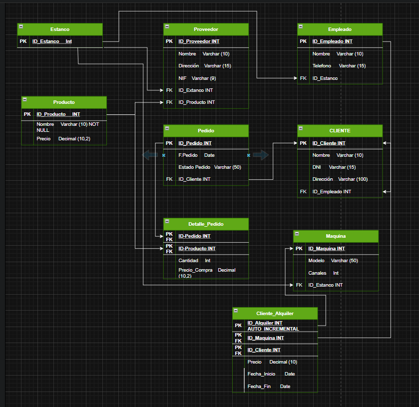
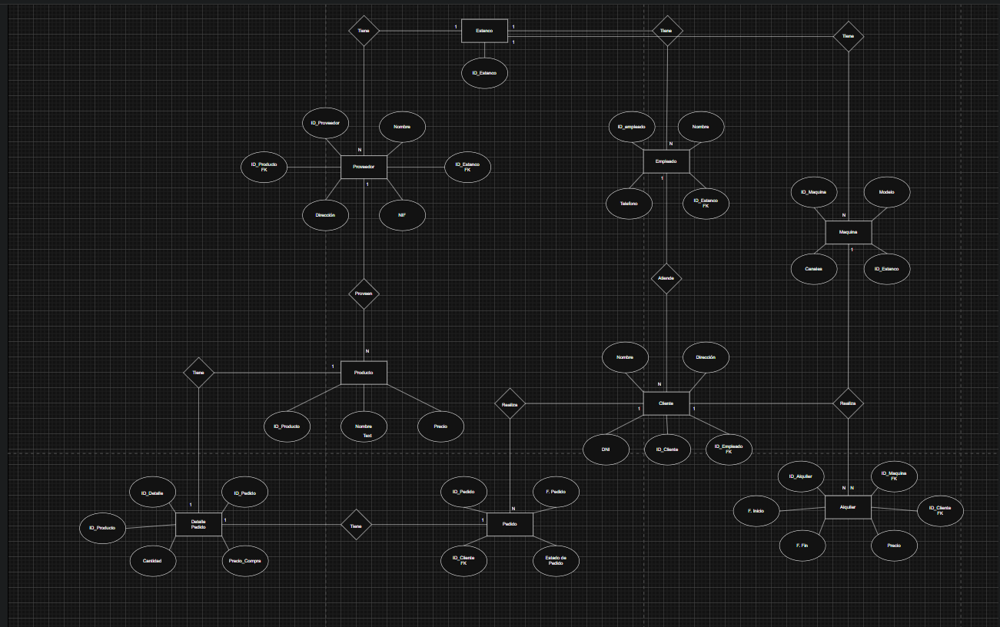
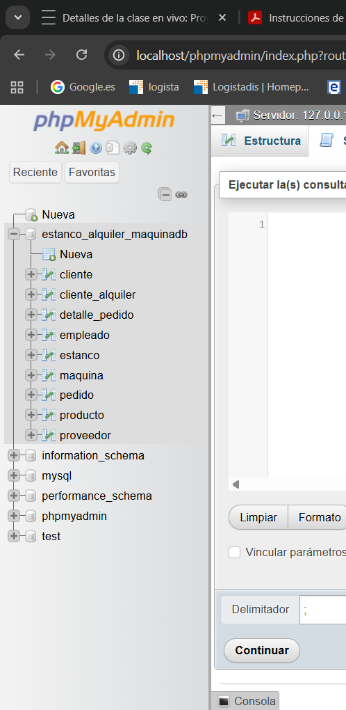
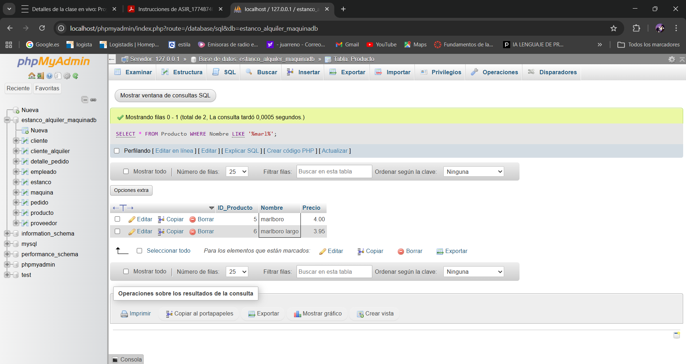
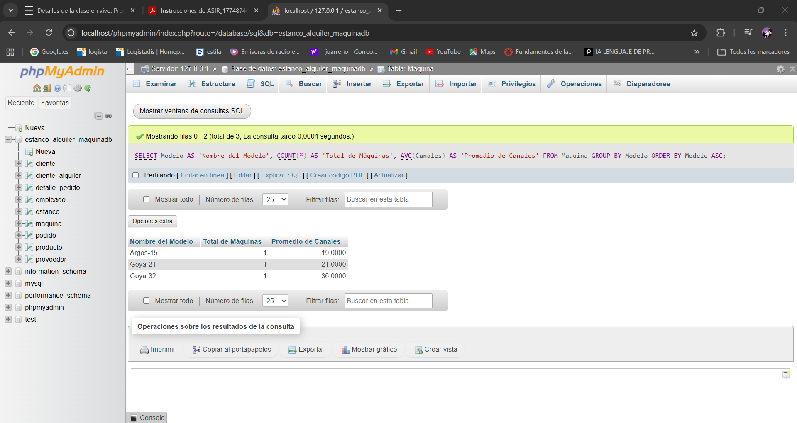

**Indice**

1. [Análisis de los datos del sistema](#1-análisis-de-los-datos-del-sistema)
2. [Diseño de la base de datos](#2-diseño-de-la-base-de-datos)
3. [Creación de la base de datos](#3-creación-de-la-base-de-datos)
4. [Inserción y gestión de datos](#4-inserción-y-gestión-de-datos)
5. [Consultas y administración básica](#5-consultas-y-administración-básica)

---

# 1. Análisis de los datos del sistema 🖥️

**Un cliente propietaria de una licencia de venta de tabacos y timbres va a abrir una nueva linea de negocio en su estanco en el que nos indica que quiere ofertar el alquiler de maquinas de tabaco para la venta de cajetillas de tabaco en segundo canal (bares, gasolineras) y poder gestionar tanto el alquiler de las máquinas, como el suministro de producto suministrado.**

**Para la parte de base de datos, nos indica que necesita la gestión de alquiler de maquina saber que productos van en las maquinas y el stock para tener un control tanto de los alquileres como de los productos incluidos en las maquinas.**

---

# 2. Diseño de la base de datos 🎨

**· Diagrama Entidad-Relación**


**· Modelo Relacional**


---

# 3. Creación de la base de datos 🛠️

```sql
CREATE DATABASE Estanco_Alquiler_MaquinaDB;  
USE Estanco_Alquiler_MaquinaDB;

-- Creación de Tablas   
CREATE TABLE Estanco (  
	ID_Estanco_Int INT PRIMARY KEY,  
	Nombre VARCHAR(50)  
);

CREATE TABLE Producto (  
	ID_Producto INT PRIMARY KEY AUTO_INCREMENT,  
	Nombre VARCHAR(50) NOT NULL,  
	Precio DECIMAL(10,2)  
);

CREATE TABLE Empleado (  
	ID_Empleado INT PRIMARY KEY AUTO_INCREMENT,  
	Nombre VARCHAR(50),  
	Telefono VARCHAR(15),  
	ID_Estanco INT,
	FOREIGN KEY (ID_Estanco) REFERENCES Estanco(ID_Estanco_Int)  
);

CREATE TABLE Maquina (  
	ID_Maquina INT PRIMARY KEY AUTO_INCREMENT,  
	Modelo VARCHAR(50),  
	Canales INT,  
	ID_Estanco INT,
	FOREIGN KEY (ID_Estanco) REFERENCES Estanco(ID_Estanco_Int)  
);

CREATE TABLE Proveedor (  
	ID_Proveedor INT PRIMARY KEY AUTO_INCREMENT,  
	Nombre VARCHAR(50),  
	Direccion VARCHAR(100),  
	NIF VARCHAR(15),  
	ID_Estanco INT,  
	ID_Producto INT,  
	FOREIGN KEY (ID_Estanco) REFERENCES Estanco(ID_Estanco_Int),  
	FOREIGN KEY (ID_Producto) REFERENCES Producto(ID_Producto)  
);  

CREATE TABLE CLIENTE (  
	ID_Cliente INT PRIMARY KEY AUTO_INCREMENT,  
	Nombre VARCHAR(50),  
	DNI VARCHAR(15),  
	Direccion VARCHAR(100),  
	ID_Empleado INT,  
	FOREIGN KEY (ID_Empleado) REFERENCES Empleado(ID_Empleado)  
);  

CREATE TABLE Pedido (  
	ID_Pedido INT PRIMARY KEY AUTO_INCREMENT,  
	Fecha_Pedido DATE,  
	Estado_Pedido VARCHAR(50),  
	ID_Cliente INT,  
	FOREIGN KEY (ID_Cliente) REFERENCES CLIENTE(ID_Cliente)  
);

CREATE TABLE Detalle_Pedido (  
	ID_Pedido INT,  
	ID_Producto INT,  
	Cantidad INT,  
	Precio_Compra DECIMAL(10,2),  
	PRIMARY KEY (ID_Pedido, ID_Producto),  
	FOREIGN KEY (ID_Pedido) REFERENCES Pedido(ID_Pedido),  
	FOREIGN KEY (ID_Producto) REFERENCES Producto(ID_Producto)  
);

CREATE TABLE Cliente_Alquiler (  
	ID_Maquina INT,  
	ID_Cliente INT,
	Precio_Alquiler Decimal (10,2),
	Fecha_Inicio DATE,
	PRIMARY KEY (ID_Maquina, ID_Cliente),
	FOREIGN KEY (ID_Maquina) REFERENCES Maquina(ID_Maquina),
	FOREIGN KEY (ID_Cliente) REFERENCES CLIENTE(ID_Cliente)
);

```

---

# 4. Inserción y gestión de datos 📋


```sql
INSERT INTO empleado (nombre, telefono)  
VALUES   
    ('Carlos Domingo', '611222333'),  
    ('Lucía San Cristobal', '622444555'),  
    ('Marcos López', '633666777');  
  
INSERT INTO cliente (nombre, dni, direccion)  
VALUES   
    ('Angel Pérez', '71622233C', 'Miguel Delibes, 34 - Burgos'),  
    ('Luciano Fernández', '16224335S', 'Santa Clara, 55 - Burgos'),  
    ('Teresa Palación', '26336667T', 'Santa Lucia, 22 - Burgos');  
  
INSERT INTO proveedor (nombre, direccion, nif)  
VALUES   
    ('Tabacalera', 'La cuesta, 4 - Madrid', 'b54183764'),   
    ('Comet', 'Santa Virginia, 22 - Madrid', 'g78269172'),   
    ('La casa del tabaco', 'Burgos, 32 - Bilbao', 'h88123455');   
  
INSERT INTO producto (nombre, precio)  
VALUES   
    ('ducados', 3.50),  
    ('camel', 3.95),  
    ('chester', 3.90),  
    ('lucky', 3.90),  
    ('marlboro', 4.00),  
    ('marlboro largo', 3.95),  
    ('winston duro', 3.95),  
    ('winston selection', 3.85),  
    ('ducados rubio', 3.75),  
    ('west', 3.65);  
  
INSERT INTO maquina (modelo, canales)  
VALUES   
    ('Argos-15', 19),  
    ('Goya-21', 21),  
    ('Goya-32', 36);


```

---

# 5. Consultas y administración básica 📊


**· Select con filtros**

```sql
SELECT * FROM Producto   
WHERE Nombre LIKE '%marl%';
```


**· Join entre tablas**

*Listado de cliente por empleados:*

```sql
SELECT   
 CLIENTE.Nombre AS Cliente,   
 Empleado.Nombre AS Atendido_Por  
FROM CLIENTE  
JOIN Empleado ON CLIENTE.ID_Empleado = Empleado.ID_Empleado;
```

**· Listados de información**

*Listado de stock por maquina:*


```sql
SELECT   
    Modelo AS 'Nombre del Modelo',   
    COUNT(*) AS 'Total de Máquinas',  
    AVG(Canales) AS 'Promedio de Canales'  
FROM Maquina  
GROUP BY Modelo  
ORDER BY Modelo ASC;
```


| Nombre del Modelo | Total de Máquinas | Promedio de Canales |
| :--- | :---: | :---: |
| Argos-15 | 1 | 19 |
| Goya-21 | 1 | 21 |
| Goya-32 | 1 | 36 |

**· Consultas de búsqueda**

*Buscar cualquier producto que contenga la palabra Rubio:*

```sql
SELECT Nombre, Precio   
FROM Producto   
WHERE Nombre LIKE '%Rubio%';   
```

**· Tareas básicas de administración**

Las tareas básicas de administración son:

*   **Actualización de precios:** `UPDATE`
*   **Gestión de bajas:** `DELETE`
*   **Control de Stock**
*   **Copias de seguridad:**
```sql
CREATE TABLE Producto_Backup AS SELECT * FROM Producto;
```
