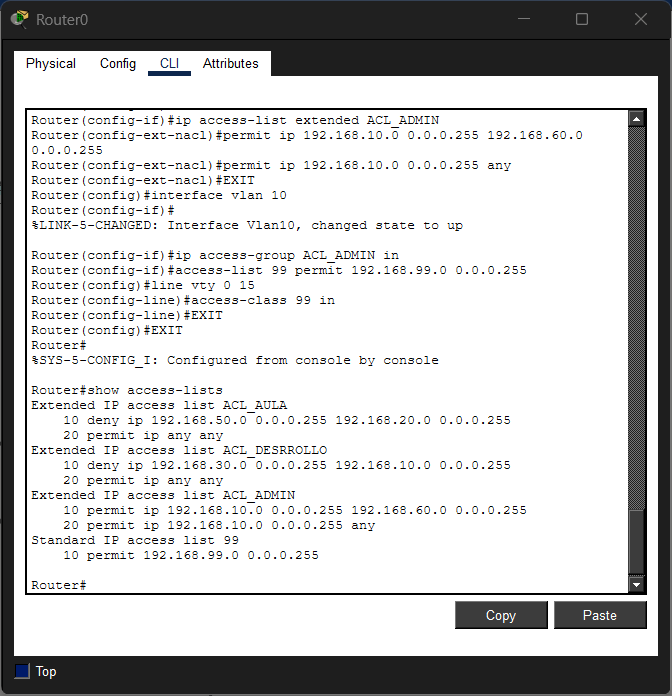
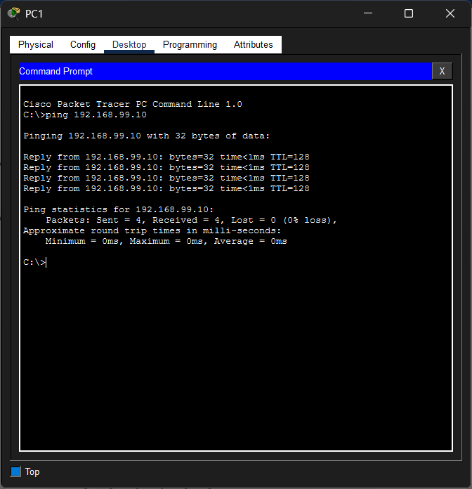
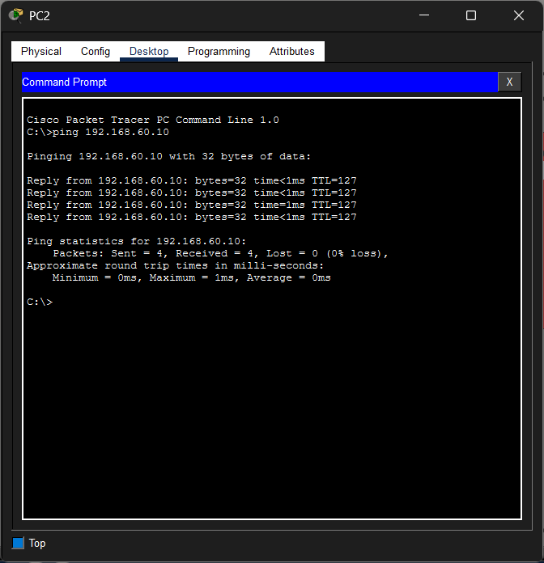
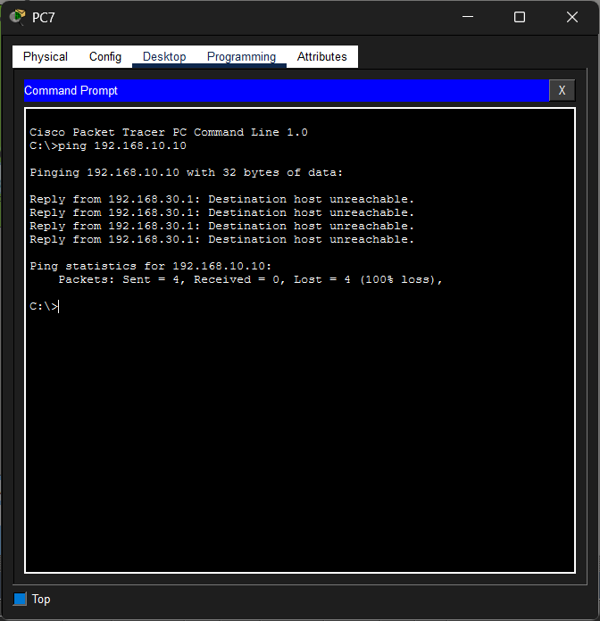

# 📑 Índice

[**1. 🌐 Inter-Vlan Routing**](#1-inter-vlan-routing)  
[**2. 📊 Tabla de direccionamiento**](#2-tabla-de-direccionamiento)  
[**3. ⚙️ Configuraciones**](#3-configuraciones)  
&nbsp;&nbsp;&nbsp;&nbsp;[1. 🛠️ Creamos las 7 vlans en los dos switch](#1-creamos-las-7-vlans-en-los-dos-switch)  
&nbsp;&nbsp;&nbsp;&nbsp;[2. 🔗 Creamos el enlace troncal entre Switches](#2-creamos-el-enlace-troncal-entre-switches)  
&nbsp;&nbsp;&nbsp;&nbsp;[3. 🖱️ Configuramos el Router on a stick](#3-configuramos-el-router-on-a-stick)  
&nbsp;&nbsp;&nbsp;&nbsp;[4. 🖥️ Configuración final del switch principal](#4-configuración-final-del-switch-principal)  
&nbsp;&nbsp;&nbsp;&nbsp;[5. 🛣️ Configurar las subinterfaces el el router](#5-configurar-las-subinterfaces-el-el-router)  
&nbsp;&nbsp;&nbsp;&nbsp;[6. 📂 Configuramos el servidor FTP VLAN60](#6-configuramos-el-servidor-ftp-vlan60)  
&nbsp;&nbsp;&nbsp;&nbsp;[7. 🔌 Configurar los Puertos del switch VLAN 60](#7-configurar-los-puertos-del-switch-vlan-60)  
&nbsp;&nbsp;&nbsp;&nbsp;[8. 💻 Configuramos los pc´s](#8-configuramos-los-pcs)  
&nbsp;&nbsp;&nbsp;&nbsp;[9. 🛡️ Configuración ACLs](#9-configuración-acls)  
&nbsp;&nbsp;&nbsp;&nbsp;[10. 📶 Configurar un punto de acceso](#10-configurar-un-punto-de-acceso)  
&nbsp;&nbsp;&nbsp;&nbsp;[11. 🤝 Conectividad dentro de la misma VLAN](#11-conectividad-dentro-de-la-misma-vlan)  
&nbsp;&nbsp;&nbsp;&nbsp;[12. ⚡ Conectividad entre VLANs permitidas](#12-conectividad-entre-vlans-permitidas)  
&nbsp;&nbsp;&nbsp;&nbsp;[13. 🚫 Bloqueo correcto por ACLs](#13-bloqueo-correcto-por-acls)

---

# 🌐 1. Inter-Vlan Routing

Implementacion Inter-VLAN routing la opción elegida el Router-on-a-stick, por que es la forma más económica y sencilla para que se comuniquen entre sí, de esa manera reducimos costos al cliente.

Al usar esta opción podemos usar switch de capa 2 y un router estandar para que los datos viajen entre la red, ya que un switch de capa 3 es mas caro economicamente hablando.

# 📊 2. Tabla de direccionamiento

| **Planta** | **Departamento** | **Vlan** | **Red** |
| :-: | :-: | :-: | :-: |
| Baja | Recepción | 99 | 192.168.99.1 |
| Baja | Administración | 10 | 192.168.10.1 |
| Baja | Dirección | 20 | 192.168.20.1 |
| Baja | Cpd | 60 | 192.168.60.1 |
| Primera | Desarrollo | 30 | 192.168.30.1 |
| Primera | Soporte Técnico | 40 | 192.168.40.1 |
| Primera | Aula de formación | 50 | 192.168.50.1 |

| **Host** | **Interfaz** | **Dirección IP** | **Mascara** | **Puerta enlace** |
| :-: | :-: | :-: | :-: | :-: |
| PLANTA BAJA |
| PC0_REC | Fa0 / Fa01 | 192.168.99.10 | 255.255.255.0 | 192.168.99.1 |
| PC1_REC | Fa0 / Fa02 | 192.168.99.11 | 255.255.255.0 | 192.168.99.1 |
| PC2_ADM | Fa0 / Fa03 | 192.168.10.10 | 255.255.255.0 | 192.168.10.1 |
| PC3_ADM | Fa0 / Fa04 | 192.168.10.11 | 255.255.255.0 | 192.168.10.1 |
| PC4_DIC | Fa0 / Fa05 | 192.168.20.10 | 255.255.255.0 | 192.168.20.1 |
| PC5_DIC | Fa0 / Fa06 | 192.168.20.11 | 255.255.255.0 | 192.168.20.1 |
| SERVER0 | Fa0 / Fa07 | 192.168.60.10 | 255.255.255.0 | 192.168.60.1 |
| SERVER1 | Fa0 / Fa08 | 192.168.60.11 | 255.255.255.0 | 192.168.60.1 |
| PRIMERA PLANTA |
| PC6_DES | Fa0 / Fa01 | 192.168.30.10 | 255.255.255.0 | 192.168.30.1 |
| PC7_DES | Fa0 / Fa02 | 192.168.30.11 | 255.255.255.0 | 192.168.30.1 |
| PC8_ST | Fa0 / Fa03 | 192.168.40.10 | 255.255.255.0 | 192.168.40.1 |
| PC9_ST | Fa0 / Fa04 | 192.168.40.11 | 255.255.255.0 | 192.168.40.1 |
| PC10_AF | Fa0 / Fa05 | 192.168.50.10 | 255.255.255.0 | 192.168.50.1 |
| PC11_AF | Fa0 / Fa06 | 192.168.50.11 | 255.255.255.0 | 192.168.50.1 |

# ⚙️ 3. Configuraciones

## 🛠️ 1. Creamos las 7 vlans en los dos switch

enable  
configure terminal  
vlan 10  
name Admin  
exit  
vlan 20  
name Direc  
exit  
vlan 30  
name Desa  
exit  
vlan 40  
name Soporte  
exit  
vlan 50  
name Formacion  
exit  
vlan 60  
name CPD  
exit  
vlan 99  
name Recepcion  
exit  

## 🔗 2. Creamos el enlace troncal entre Switches

en el puerto que conecta los dos switch (GIG02)

interface GigabitEthernet 0/2  
switchport mode trunk

## 🖱️ 3. Configuramos el Router on a stick

· Entra a la interfaz conectada al switch ej GIG0/0 y la encendemos

interface GigabitEthernet 0/0  
no shutdown  

· Creamos una subinterfaz por cada departamento (VLAN)

interface GigabitEthernet 0/0.10  
encapsulation dot1Q 10  
ip address 192.168.10.1 255.255.255.0  
  
interface GigabitEthernet 0/0.20  
encapsulation dot1Q 20  
ip address 192.168.20.1 255.255.255.0

## 🖥️ 4. Configuración final del switch principal

El puerto del switch que va al router debe estar en modo trunk

1 Switch planta 1

interface GigabitEthernet 0/2  
switchport mode trunk

## 🛣️ 5. Configurar las subinterfaces el el router

para que todas las VLANs se comuniquen con el servidor FTP, el router necesita una subinterfaz por cada rec. Entramos a la interfaz conectada al switch GIG0/1

enable  
configure terminal  
interface GigabitEthernet 0/1  
no ip address  
no shutdown  
exit  

## VLAN 10 - Admin  
interface GigabitEthernet 0/1.10  
 encapsulation dot1Q 10  
 ip address 192.168.10.1 255.255.255.0  
exit  
  
## VLAN 20 - Dir  
interface GigabitEthernet 0/0.20  
 encapsulation dot1Q 20  
 ip address 192.168.20.1 255.255.255.0  
exit  
  
## VLAN 30 - Desa  
interface GigabitEthernet 0/0.30  
 encapsulation dot1Q 30  
 ip address 192.168.30.1 255.255.255.0  
exit  
  
## VLAN 40 – Soporte  
interface GigabitEthernet 0/0.40  
 encapsulation dot1Q 40  
 ip address 192.168.40.1 255.255.255.0  
exit  
  
## VLAN 50 - Formacion  
interface GigabitEthernet 0/0.50  
 encapsulation dot1Q 50  
 ip address 192.168.50.1 255.255.255.0  
exit  
  
## VLAN 60 - CPD  
interface GigabitEthernet 0/0.60  
 encapsulation dot1Q 60  
 ip address 192.168.60.1 255.255.255.0  
exit  
  
## VLAN 99 - Recepcion  
interface GigabitEthernet 0/0.99  
 encapsulation dot1Q 99  
 ip address 192.168.99.1 255.255.255.0  
exit  

## 📂 6. Configuramos el servidor FTP VLAN60

Conectamos el servidor al switch planta 1 Fa0/24

IP: 192.168.60.10  
Mascara: 255.255.255.0  
Gateway 192.168.60.1  

Servicio FTP: Pestaña Services FTP, ON y crear un usuario

## 🔌 7. Configurar los Puertos del switch VLAN 60

Switch planta 1

vlan 60  
 name Servidores  
exit  
interface fastEthernet 0/24  
 switchport mode access  
 switchport access vlan 60

## 💻 8. Configuramos los pc´s

en cualquier pc  
vlan 10 – Administración  

IP 192.168.10.10  
Gateway: 192.168.1.10.1

## 🛡️ 9. Configuración ACLs

En el router  

1· Bloquear Aula VLAN50 hacia Dirección VLAN20  

ip access-list extended ACL_AULA  
deny ip 192.168.50.0 0.0.0.255 192.168.20.0 0.0.0.255  
permit ip any any  
exit  
  
interface vlan 50 (o gi0/0.50 en Router)  
ip access-group ACL_AULA in  

2· Bloquear Desarrollo VLAN30 hacia Administración VLAN10  

ip access-list extended ACL_DESARROLLO  
 deny ip 192.168.30.0 0.0.0.255 192.168.10.0 0.0.0.255  
 permit ip any any  
exit  
  
interface vlan 30 (o gi0/0.30 en Router)  
 ip access-group ACL_DESARROLLO in

3· Permitir Administración VLAN10 a Servidores VLAN60  

ip access-list extended ACL_ADMIN  
 permit ip 192.168.10.0 0.0.0.255 192.168.60.0 0.0.0.255  
 permit ip 192.168.10.0 0.0.0.255 any  
exit  
  
interface vlan 10 (o gi0/0.10 en Router)  
 ip access-group ACL_ADMIN in

4· Solo la VLAN MGMT VLAN99 administra dispositivos  

access-list 99 permit 192.168.99.0 0.0.0.255  
line vty 0 15
 access-class 99 in
exit

## 📶 10. Configurar un punto de acceso

preparar las VLANs en el Switch

interface FastEthernet0/10  # Puerto donde está el AP
 switchport mode trunk
 switchport trunk allowed vlan 10,50

Configurar el punto de acceso

SSID: SSID_ESTANCO
Authentication: WPA2-PSK
VLAN ID:10

En el router para aislar a los invitados y que no vean la empresa:

# Definir la ACL para Invitados
ip access-list extended ACL_INVITADOS
 
 # Denegar acceso a todas las redes internas (192.168.0.0/16 cubre todas tus VLANs)
 deny ip 192.168.50.0 0.0.0.255 192.168.0.0 0.0.255.255
 
 # Permitir todo lo demás (Internet)
 permit ip 192.168.50.0 0.0.0.255 any
exit

# Aplicar a la interfaz de la VLAN de invitados
interface gig0/0.50  # O interface vlan 50
 ip access-group ACL_INVITADOS in

## 🤝 11. Conectividad dentro de la misma VLAN

## ⚡ 12. Conectividad entre VLANs permitidas

## 🚫 13. Bloqueo correcto por ACLs

